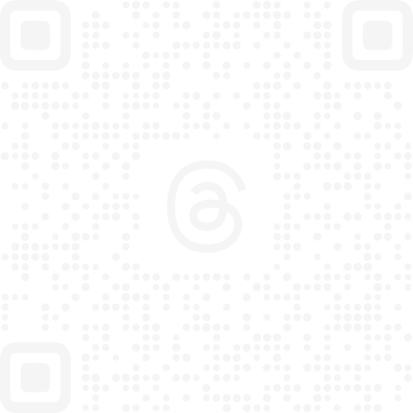
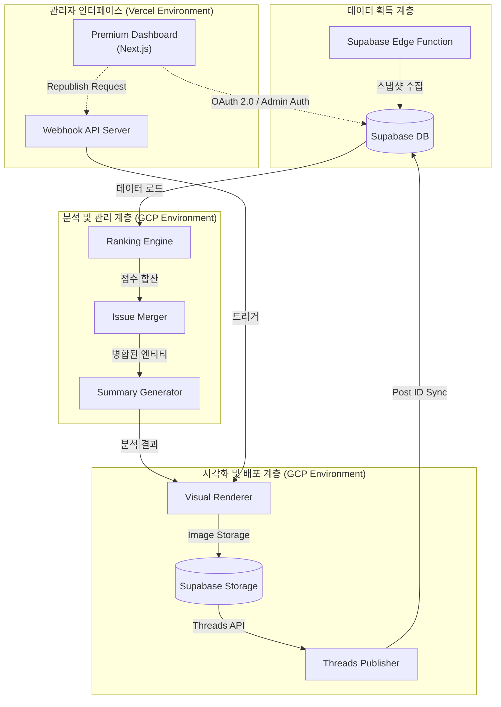
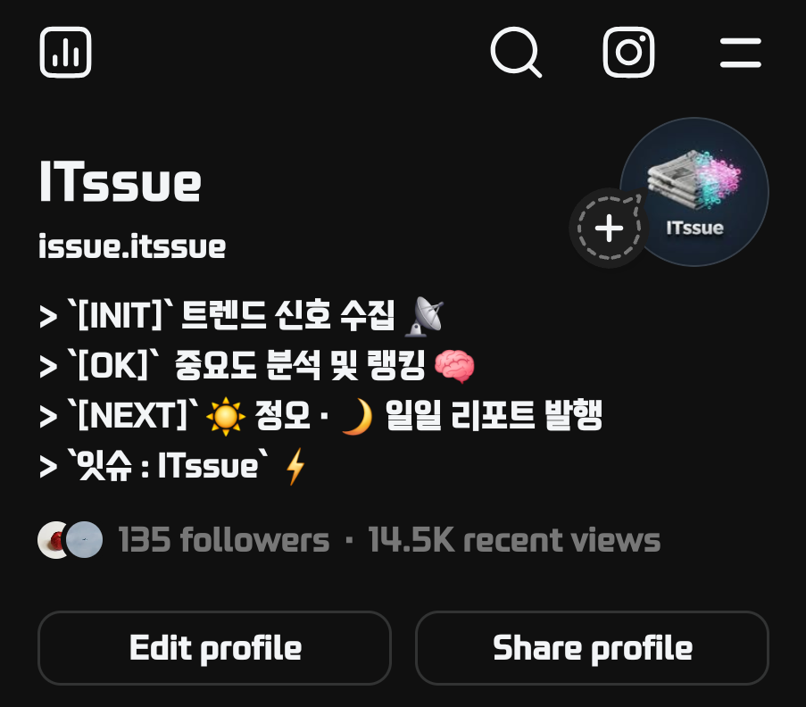
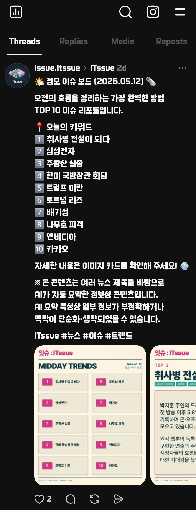
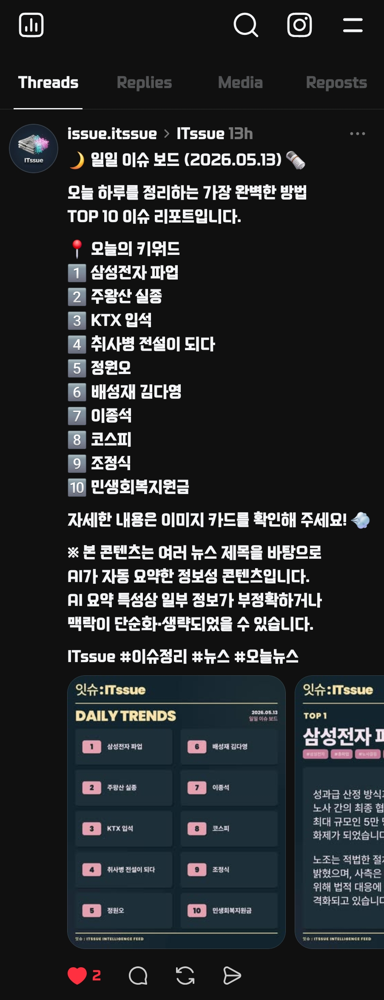

# ITssue: Autonomous Trend Intelligence Engine

    

<div align="center">
  
</div>


## 1. 프로젝트 개요

**ITssue**는 실시간 트렌드 데이터를 스스로 수집하고, 최신 인공지능(Search Grounding) 기술을 통해 심층 분석하여 자동화된 인사이트 리포트와 시각적 카드뉴스 콘텐츠를 생성/발행하는 **자율형 데이터 파이프라인 엔진**입니다. 

단순히 인기 검색어를 나열하는 수준을 넘어, 사건의 본질적인 원인을 분석하고 가독성 높은 시각 자산으로 변환하여 **Threads**에 게시하는 전 과정을 사람의 개입 없이 완결합니다. (현재 인스타그램/페이스북 발행은 레거시로 유지하며 Threads 중심으로 운영 중입니다.)

---

### 📱 Official Channel
현재 서비스가 실제로 운영되고 있는 채널입니다. QR 코드를 스캔하거나 링크를 통해 실시간 분석 결과물을 확인하실 수 있습니다.

| **Threads Feed** | **QR Code** |
| :--- | :--- |
| [itssue - 트렌드 지능형 분석 엔진](https://www.threads.net/@issue.itssue) |  |

---

## 2. 주요 기능

- **Intelligent Search Grounding:** 단순 요약을 넘어 실시간 웹 검색 결과를 기반으로 키워드의 배경과 화제성을 심층 분석하여 신뢰도 높은 인사이트를 추출합니다.
- **Self-Healing AI Pipeline:** API 할당량 초과(429)나 네트워크 장애 발생 시, 등록된 여러 개의 API 키를 순환(`Rotation`)하고 지수 백오프(`Exponential Backoff`) 전략을 통해 무중단 분석을 보장합니다.
- **Advanced Issue Merging:** 동일한 사건에 대해 파편화되어 유입되는 검색어들을 Jaccard 유사도와 형태소 분석을 통해 하나의 유의미한 이슈 그룹으로 병합하고 영향력을 통합 집계합니다.
- **Dynamic Visual Rendering:** Puppeteer를 활용하여 소셜 미디어 피드 점유율이 가장 높은 **4:5 비율(1080x1350)**의 카드뉴스를 자동 생성합니다. 텍스트 길이에 따라 폰트 크기를 실시간 조절하는 자바스크립트 엔진이 포함되어 있습니다.
- **Theme Synchronization Engine:** 발행 시각(정오/야간)에 따라 최적의 테마(**Arcade/Bubblegum**)를 자동으로 배정하며, 대시보드 UI 또한 시간대에 따라 유기적으로 반응하여 최상의 시각적 일관성을 유지합니다.
- **Full-Auto Publishing:** 분석 데이터와 렌더링된 이미지를 Supabase Storage와 연동하고, Threads API를 통해 캡션 포함 캐러셀(Carousel) 형태로 자동 게시합니다. 게시물 고유 ID를 즉시 추적하여 대시보드에 실시간 동기화합니다.
- **Unified Admin Dashboard (Premium):** Vercel에 최적화된 Next.js 기반 대시보드를 통해 발행 상태를 실시간 모니터링(Activity Pulse)하고, AI 요약본을 수동 수정하거나 재발행할 수 있는 고급 제어 기능을 제공합니다.
- **Strict Security Guard:** 관리자 전용 이메일 화이트리스트 검증 및 Supabase Auth 보호 계층을 통해 승인된 마스터 관리자 외의 접근을 원천 차단합니다.
- **High-Quality Code Architecture:** 중앙 집중형 타입 시스템, 표준화된 주석 체계, 프로젝트 전역 로깅 시스템(Logger)을 통해 프로젝트의 완성도와 유지보수성을 극대화했습니다.

## 3. 기술 아키텍처 및 구현

데이터 수집부터 최종 발행까지 계층화된 **Pipe-and-Filter 아키텍처**로 설계되었습니다.



## 4. 문제 해결 및 기술 의사결정 과정

- **문제 1: 파편화된 검색어 데이터의 통계 왜곡**
  - **해결:** **Jaccard Similarity**와 **Overlap Ratio** 알고리즘을 결합한 병합 게이트를 구축했습니다. 텍스트의 공통 분모를 분석하고 인물/단체 등 핵심 엔티티를 비교하여 관련 이슈를 하나의 그룹으로 병합하고 점수를 합산함으로써 통계적 정합성을 확보했습니다.

- **문제 2: 클라우드 AI API의 할당량 제한(Rate Limit)**
  - **해결:** **Multi-Key Rotation 시스템**을 도입했습니다. 여러 개의 API 키를 순환하며 상태를 추적하고, 장애 발생 시 즉시 다음 키를 사용하도록 설계했습니다.

- **문제 3: 서버 환경과 로컬 데이터 간의 시각 처리(Timezone) 불일치**
  - **해결:** 모든 유입 데이터에 명시적인 타임존 오프셋(`+09:00`)을 부여하는 `normalizeKstTimestamp` 헬퍼 함수를 구현하여 KST 기반의 정확한 분석 주기를 계산할 수 있도록 동기화했습니다.

- **문제 4: 소셜 미디어 다변화 및 Threads 연동**
  - **해결:** Instagram API의 제약을 넘어 더 텍스트 친화적인 Threads API로 전환했습니다. 캐러셀 발행 시 공식 토픽 태그(`topic_tag`)를 활용하여 노출을 극대화하고, 기존 DB 스키마를 유지하면서 새로운 플랫폼 ID를 안정적으로 맵핑했습니다.

## 5. 데이터 기반 성과 분석 (Data-Driven Insights)

프로젝트 운영 과정에서 수집된 실제 데이터를 분석하여 서비스의 효과를 검증했습니다. (2026.01.24 ~ 2026.02.13 데이터 기준)

### 📊 1. 릴스(Reels)의 압도적 효율성 입증
동일한 콘텐츠라도 전달 방식에 따라 도달률에 극명한 차이가 발생함을 확인했습니다.
- **Short-form Video (Reels)**: 평균 도달 **104.3** (User/Post)
- **Static Image (Slide)**: 평균 도달 **3.0** (User/Post)
👉 **Insight**: 정적인 정보 전달보다 **숏폼 영상 형태**의 콘텐츠가 약 **35배** 높은 확산력을 가짐을 데이터로 증명했습니다. 이를 바탕으로 정지 이미지 위주의 파이프라인을 영상 결합형(Hybrid)으로 진화시키고 있습니다.

### ☀️ 2. 시간대별 소비 패턴 (Time-slot Analysis)
- **점심(NOON) 보드**: 평균 도달 **56.8**
- **저녁(NIGHT) 보드**: 평균 도달 **50.4**
👉 **Insight**: 미세하지만 점심 시간대에 정보성 콘텐츠 소비가 더 활발함을 확인했습니다. 직장인/학생들의 점심 시간을 타겟팅한 'Midday Trends' 전략의 유효성을 입증했습니다.

### 🏷️ 3. 고효율 키워드 발굴 (Top Performing Tags)
가장 높은 도달을 기록한 해시태그 TOP 3는 다음과 같습니다.
1. **#트렌드분석** (Avg Reach: 55.8)
2. **#뉴스** (Avg Reach: 55.7)
3. **#실시간이슈** (Avg Reach: 54.6)
👉 단순 나열식 태그보다 **'분석', '뉴스', '이슈'** 같이 정보의 성격을 명확히 드러내는 태그가 사용자 반응을 더 잘 이끌어냄을 발견했습니다.

---

## 6. 코드 품질 및 보안

### 📐 중앙 집중형 타입 시스템
- **단일 진실 공급원(Single Source of Truth)**: `src/types/index.ts`를 중심으로 모든 데이터 인터페이스를 통합 관리합니다.

### 🔒 보안 (Security Protocols)
- **Master Admin Validation**: 코드 레벨에서 관리자 이메일을 엄격히 검증하여 부정한 접근을 즉시 차단합니다.
- **Supabase Auth Lockdown**: 신규 회원 가입을 금지하고 등록된 관리자 계정으로만 접근을 허용하는 폐쇄적 보안 구조를 적용했습니다.
- **Vercel & GCP Hybrid Optimization**: 민감한 환경 변수는 Vercel Dashboard와 GCP `.env`에 분리하여 보안 사고 위험을 최소화했습니다.

---

## 7. 핵심 운영 Guide (Core Operations)

### ☀️ 이슈 보드 수동 생성
```bash
# 정오 보드 생성 (Arcade 테마)
npm run board:noon -- --publish

# 야간 보드 생성 (Bubblegum 테마)
npm run board:night -- --publish
```

### 🌍 배포 환경 설정
- **Backend (GCP/Ubuntu)**: `itssue-daemon`(자동 분석)과 `itssue-api`(웹훅 서버)가 상시 가동되어야 합니다.
- **Frontend (Vercel)**: `admin` 디렉토리의 Next.js 프로젝트를 배포하여 어디서든 관리할 수 있습니다.

---

## 8. 향후 개선 방향

- **AI Audit System:** AI가 생성한 요약문을 스스로 검토하여 사실 관계가 틀리거나 비문인 경우 재생성하는 자가 교정 로직 도입 예정.
- **Video Generator Upgrade:** 정지된 카드뉴스 이미지를 넘어 동적인 모션 그래픽이 포함된 'Reels'형 영상 리포트 자동 생성 기능 고도화.

## 9. 실행 결과 (Actual Outputs)

프로젝트를 통해 실제로 생성되어 인스타그램에 업로드되는 고해상도 전체 피드(Full Feed) 예시입니다.

<div align="center">
  <h3>[분석 리포트 & 주요 이슈 카드]</h3>
  <table style="width: 100%; border-collapse: collapse;">
    <tr>
      <td width="33%"></td>
      <td width="33%"></td>
      <td width="33%"></td>
    </tr>
    <tr align="center">
      <td><b>P1. 종합 랭킹</b></td>
      <td><b>P2. 심층 분석 01</b></td>
      <td><b>P3. 심층 분석 02</b></td>
    </tr>
    <tr>
      <td width="33%"></td>
      <td width="33%"></td>
      <td width="33%"></td>
    </tr>
    <tr align="center">
      <td><b>P4. 심층 분석 03</b></td>
      <td><b>P5. 그룹 요약 A</b></td>
      <td><b>P6. 그룹 요약 B</b></td>
    </tr>
  </table>

  <br>

  <h3>[Threads 실제 발행 사례]</h3>
  <table style="width: 100%; border-collapse: collapse;">
    <tr align="center">
      <td colspan="2"><br><b>Threads Profile</b></td>
    </tr>
    <tr align="center">
      <td width="50%"><br><b>Threads Feed 1</b></td>
      <td width="50%"><br><b>Threads Feed 2</b></td>
    </tr>
  </table>
</div>

---
**ITssue**는 데이터에 대한 깊은 이해와 문제 해결을 위한 공학적 접근이 담긴 프로젝트입니다.
