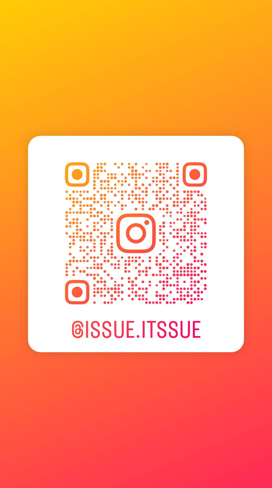
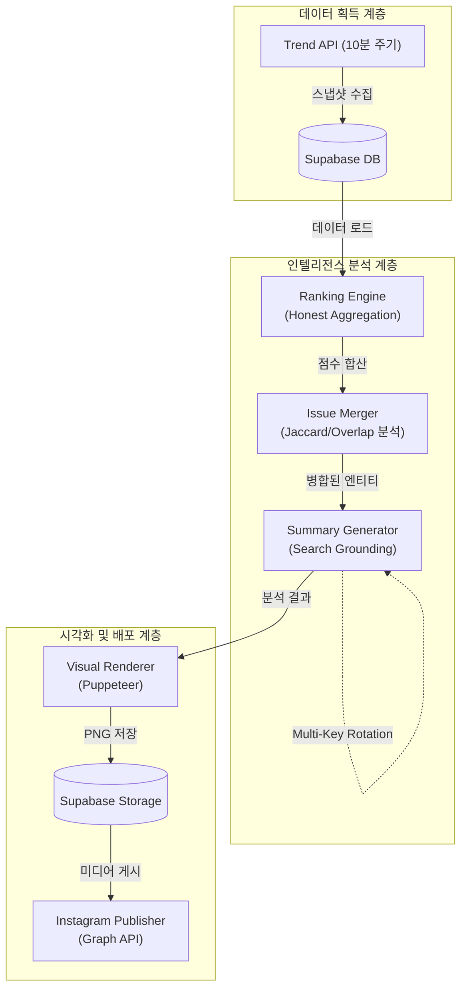
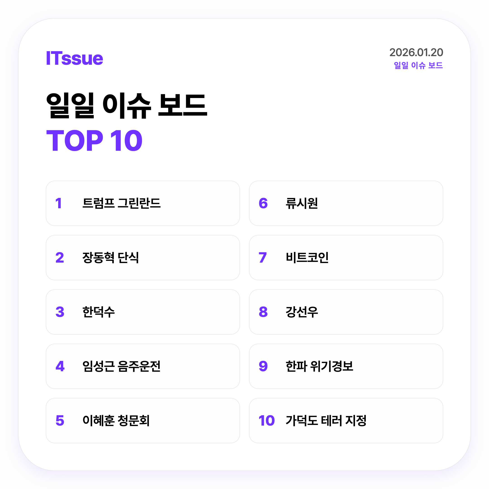
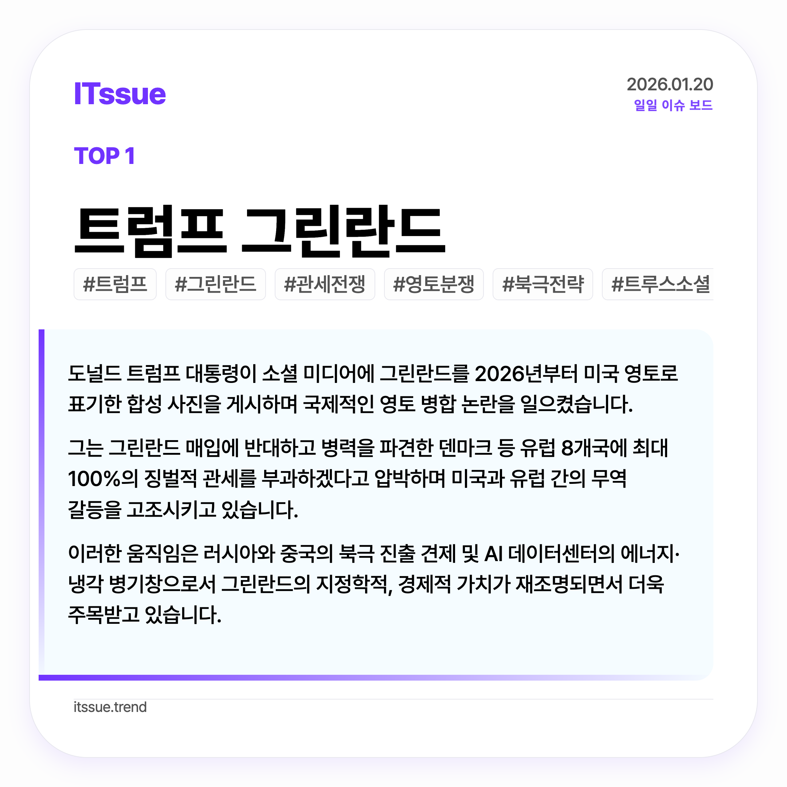
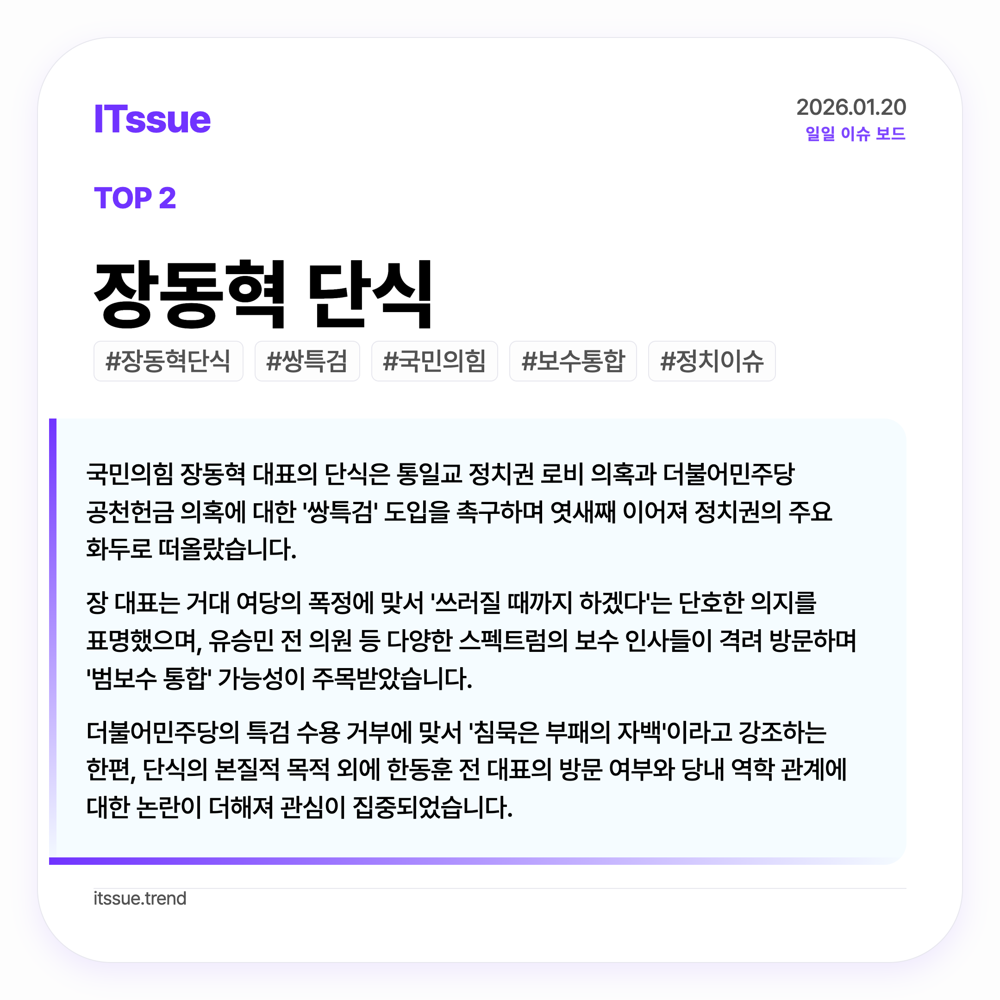
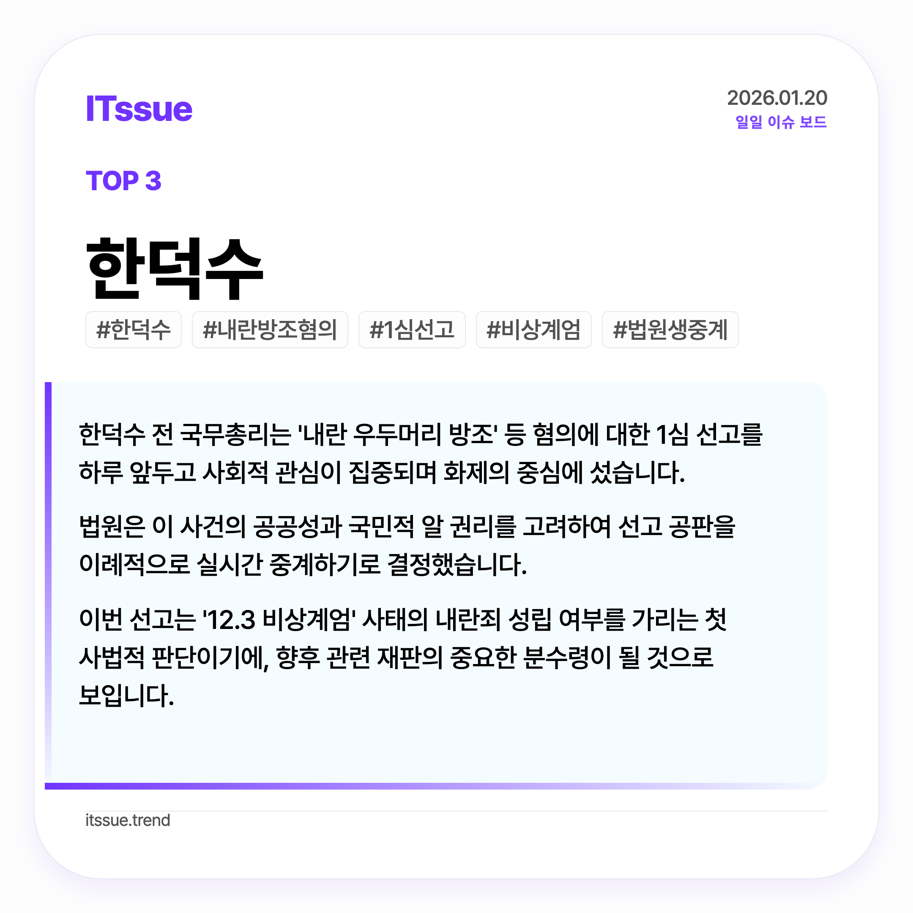
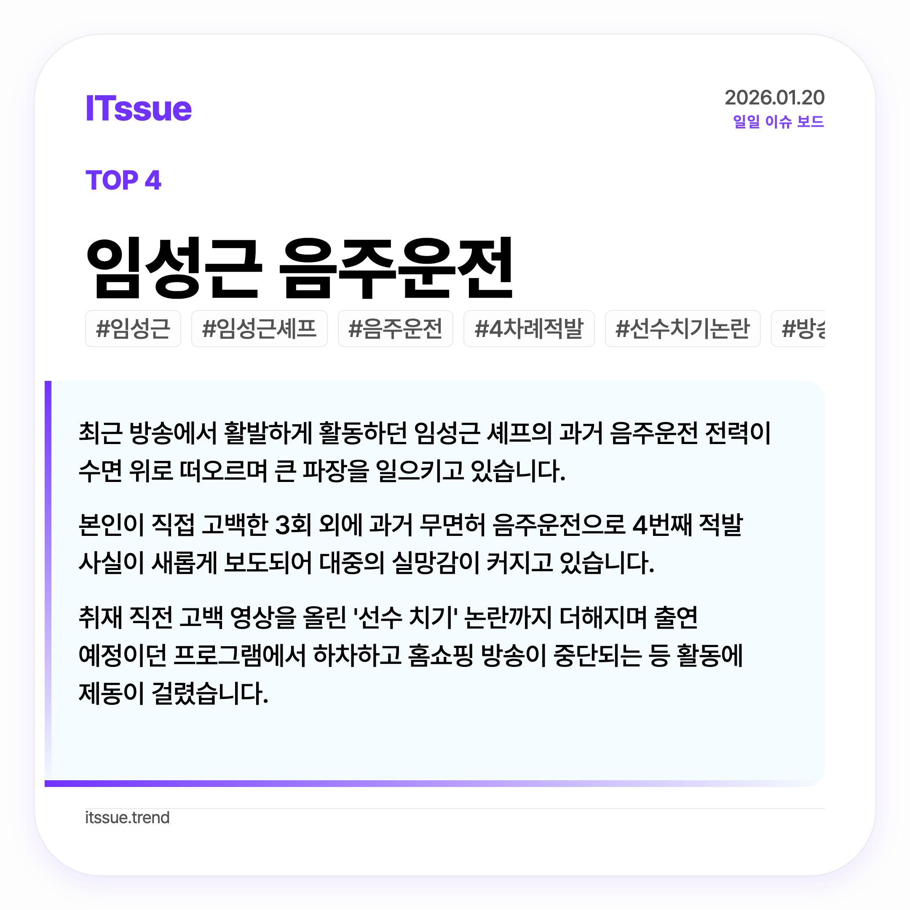
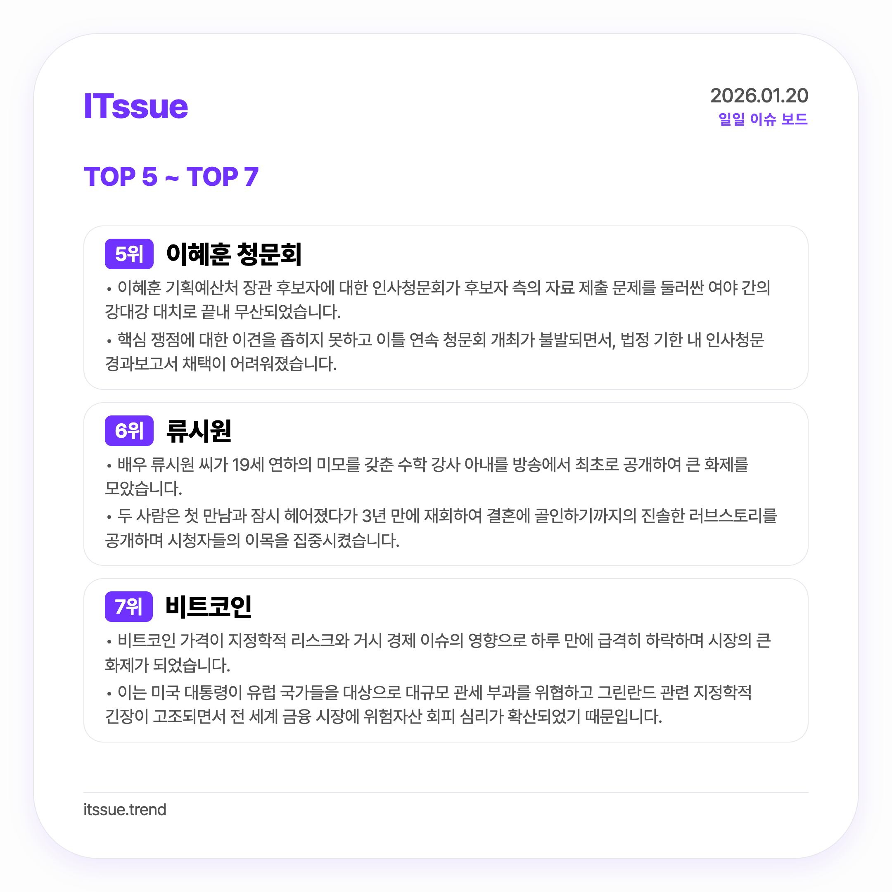
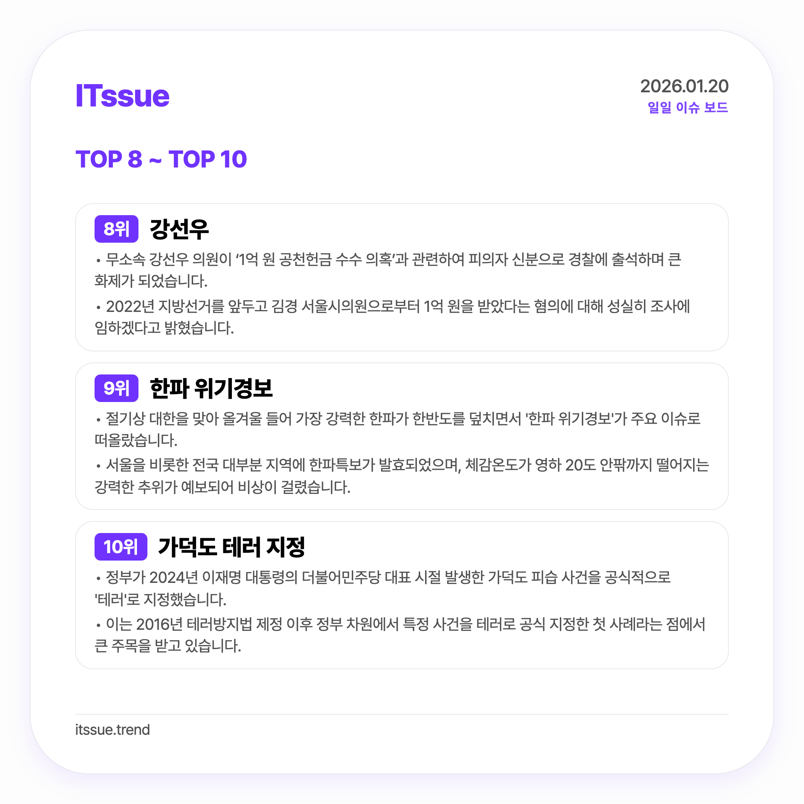

# ITssue: Autonomous Trend Intelligence Engine

    

## 1. 프로젝트 개요

**ITssue**는 실시간 트렌드 데이터를 스스로 수집하고, 최신 인공지능(Search Grounding) 기술을 통해 심층 분석하여 자동화된 인사이트 리포트와 시각적 카드뉴스 콘텐츠를 생성/발행하는 **자율형 데이터 파이프라인 엔진**입니다. 

단순히 인기 검색어를 나열하는 수준을 넘어, 사건의 본질적인 원인을 분석하고 가독성 높은 시각 자산으로 변환하여 인스타그램에 게시하는 전 과정을 사람의 개입 없이 완결합니다.

---

### 📱 Official Channel
현재 서비스가 실제로 운영되고 있는 채널입니다. QR 코드를 스캔하거나 링크를 통해 실시간 분석 결과물을 확인하실 수 있습니다.

| **Instagram Feed** | **QR Code** |
| :--- | :--- |
| [itssue - 트렌드 지능형 분석 엔진](https://www.instagram.com/issue.itssue/) |  |

---

## 2. 주요 기능

- **Intelligent Search Grounding:** 단순 요약을 넘어 실시간 웹 검색 결과를 기반으로 키워드의 배경과 화제성을 심층 분석하여 신뢰도 높은 인사이트를 추출합니다.
- **Self-Healing AI Pipeline:** API 할당량 초과(429)나 네트워크 장애 발생 시, 등록된 여러 개의 API 키를 순환(`Rotation`)하고 지수 백오프(`Exponential Backoff`) 전략을 통해 무중단 분석을 보장합니다.
- **Advanced Issue Merging:** 동일한 사건에 대해 파편화되어 유입되는 검색어들을 Jaccard 유사도와 형태소 분석을 통해 하나의 유의미한 이슈 그룹으로 병합하고 영향력을 통합 집계합니다.
- **Dynamic Visual Rendering:** Puppeteer를 활용하여 1080x1080 인스타그램 포맷의 카드뉴스를 자동 생성합니다. 텍스트 길이에 따라 폰트 크기를 실시간 조절하는 자바스크립트 엔진이 포함되어 있습니다.
- **Full-Auto Publishing:** 분석 데이터와 렌더링된 이미지를 Supabase Storage와 연동하고, Instagram Graph API를 통해 캡션 포함 캐러셀(Carousel) 형태로 자동 게시합니다.

## 3. 기술 아키텍처 및 구현

데이터 수집부터 최종 발행까지 계층화된 Pipe-and-Filter 아키텍처로 설계되었습니다.

## 4. 문제 해결 및 기술 의사결정 과정

- **문제 1: 파편화된 검색어 데이터의 통계 왜곡**
  - **현상:** 동일한 사건(예: 특정 인물 이슈)임에도 "이름", "이름 사건", "이름 결과" 등 서로 다른 키워드로 분산되어 순위권에서 밀려나는 현상 발생.
  - **분석:** 단순 문자열 일치 방식으로는 실시간 검색어의 변동성을 따라갈 수 없음을 확인.
  - **해결:** **Jaccard Similarity**(자카드 유사도)와 **Overlap Ratio** 알고리즘을 결합한 병합 게이트를 구축했습니다. 텍스트의 공통 분모를 분석하고 인물/단체 등 핵심 엔티티를 비교하여 관련 이슈를 하나의 그룹으로 병합하고 점수를 합산함으로써 통계적 정합성을 확보했습니다.

- **문제 2: 클라우드 AI API의 할당량 제한(Rate Limit)**
  - **현상:** AI 분석 API 무료 티어 사용 시 정해진 시간 내 요청 횟수를 초과(429 Error)하여 파이프라인이 중단되는 문제 발생.
  - **분석:** 단일 API 키로는 10분 주기 또는 다량의 키워드 분석 시 안정성을 보장하기 어려움.
  - **해결:** **Multi-Key Rotation 시스템**을 도입했습니다. 여러 개의 API 키를 순환하며 상태를 추적하고, 장애 발생 시 즉시 다음 키를 사용하도록 설계했습니다. 또한 `Wait-and-Retry` 전략과 점진적 대기 시간을 적용하여 24시간 자율 운영 환경에서의 회복 탄력성을 높였습니다.

- **문제 3: 서버 환경과 로컬 데이터 간의 시각 처리(Timezone) 불일치**
  - **현상:** 클라우드 서버(UTC)와 데이터 소스(KST) 간의 9시간 오차로 인해 특정 시간대(정오/일일)의 데이터가 윈도우 분석에서 누락되는 현상.
  - **분석:** `toISOString()` 사용 시 타임존 오프셋이 소실되어 Supabase 쿼리 시 잘못된 데이터 범위를 참조함.
  - **해결:** 모든 유입 데이터에 명시적인 타임존 오프셋(`+09:00`)을 부여하는 `normalizeKstTimestamp` 헬퍼 함수를 구현했습니다. 이를 통해 DB에는 절대 시각(UTC)으로 저장하되, 비즈니스 로직에서는 KST 기반의 정확한 분석 주기를 계산할 수 있도록 동기화했습니다.

## 5. 배포 및 운영

- **Infrastructure:** **Supabase**를 백엔드 서버리스 플랫폼으로 채택하여 DB 관리 및 이미지 스토리지로 활용합니다.
- **Batch Processing:** 10분 단위의 데이터 수집과 하루 2회(정오, 밤)의 메인 분석 파이프라인을 자동화했습니다.
- **Monitoring:** 모든 실행 로그는 자체 개발한 `Logger` 모듈을 통해 관리되며, 최종 결과물은 `output/` 디렉토리에 시계열별로 영구히 보존됩니다.

## 6. 향후 개선 방향

- **AI Audit System:** AI가 생성한 요약문을 스스로 검토하여 사실 관계가 틀리거나 비문인 경우 재생성하는 자가 교정 로직 도입 예정.
- **Multi-Platform:** 인스타그램 외에 스레드(Threads), 트위터(X) 등 여러 소셜 채널로 발행 플랫폼 확장.

## 7. 실행 결과 (Actual Outputs)

프로젝트를 통해 실제로 생성되어 인스타그램에 업로드되는 고해상도 전체 피드(Full Feed) 예시입니다.

  <h3>[분석 리포트 & 주요 이슈 카드]</h3>
  <table style="width: 100%; border-collapse: collapse;">
    <tr>
      <td width="25%"></td>
      <td width="25%"></td>
      <td width="25%"></td>
      <td width="25%"></td>
    </tr>
    <tr align="center">
      <td><b>P1. 종합 랭킹</b></td>
      <td><b>P2. 심층 분석 01</b></td>
      <td><b>P3. 심층 분석 02</b></td>
      <td><b>P4. 심층 분석 03</b></td>
    </tr>
    <tr>
      <td width="25%"></td>
      <td width="25%"></td>
      <td width="25%"></td>
      <td width="25%"></td>
    </tr>
    <tr align="center">
      <td><b>P5. 심층 분석 04</b></td>
      <td><b>P6. 그룹 요약 A</b></td>
      <td><b>P7. 그룹 요약 B</b></td>
      <td></td>
    </tr>
  </table>

   

  <h3>[인스타그램 실제 발행 사례]</h3>
  <table style="width: 100%; border-collapse: collapse;">
    <tr>
      <td width="50%"></td>
      <td width="50%"></td>
    </tr>
    <tr align="center">
      <td><b>Instagram Feed 예시 1</b></td>
      <td><b>Instagram Feed 예시 2</b></td>
    </tr>
  </table>

---
**ITssue**는 데이터에 대한 깊은 이해와 문제 해결을 위한 공학적 접근이 담긴 프로젝트입니다.
