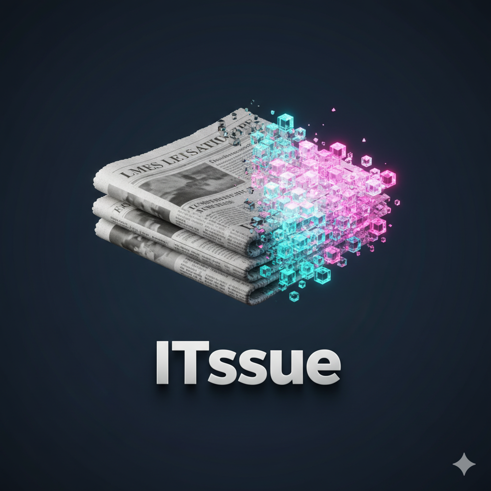
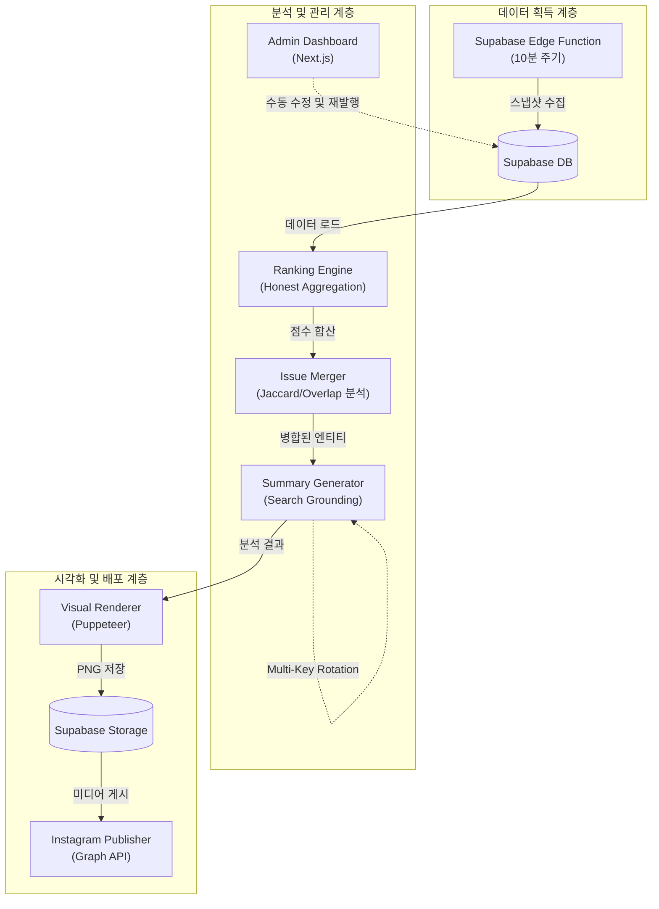
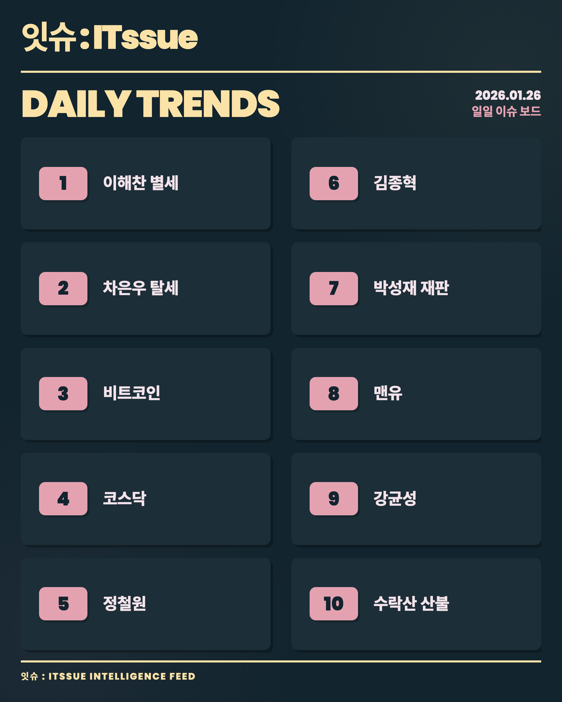
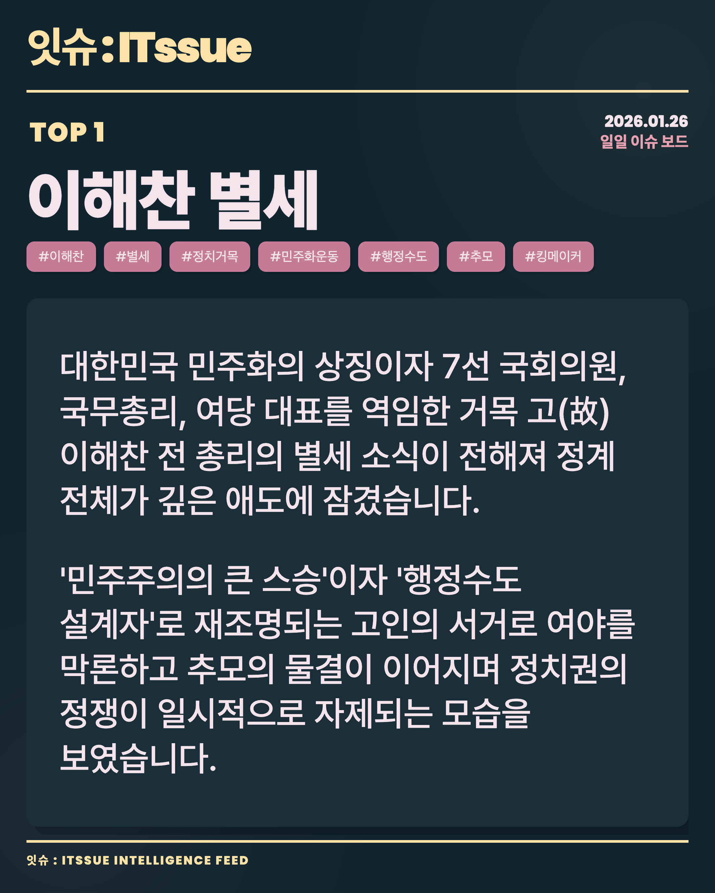
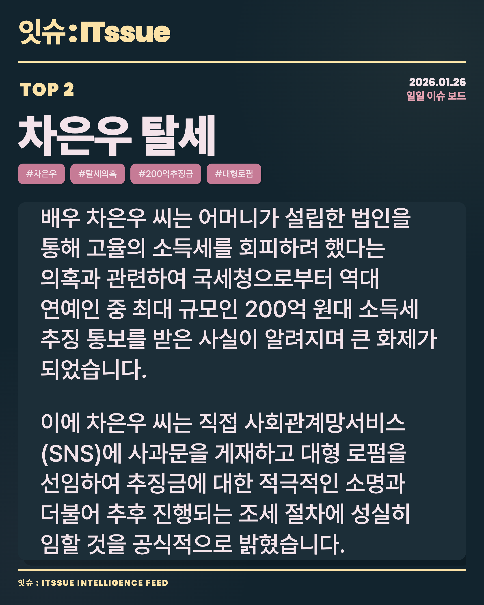
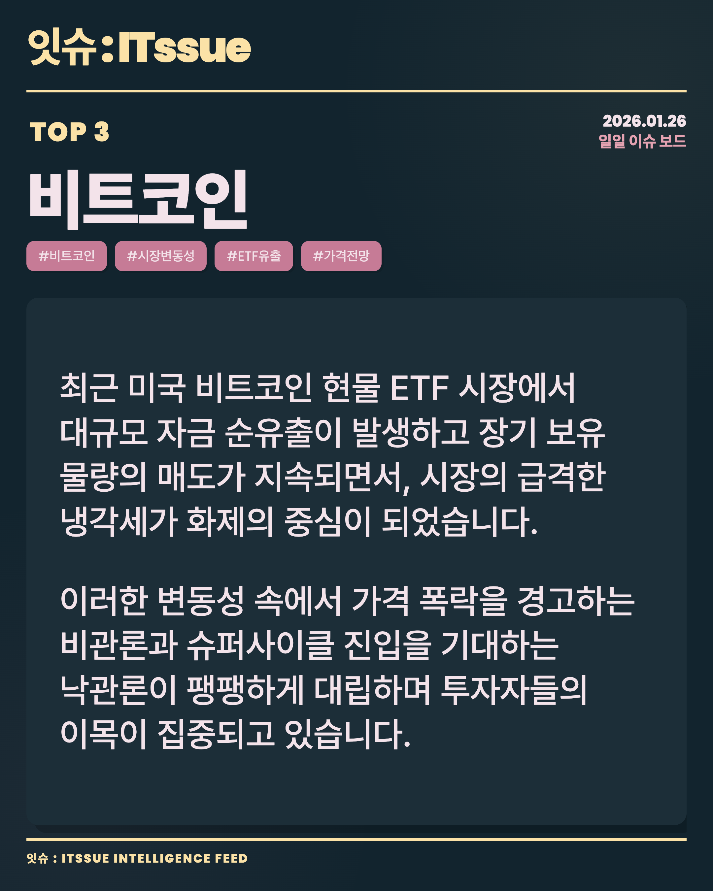
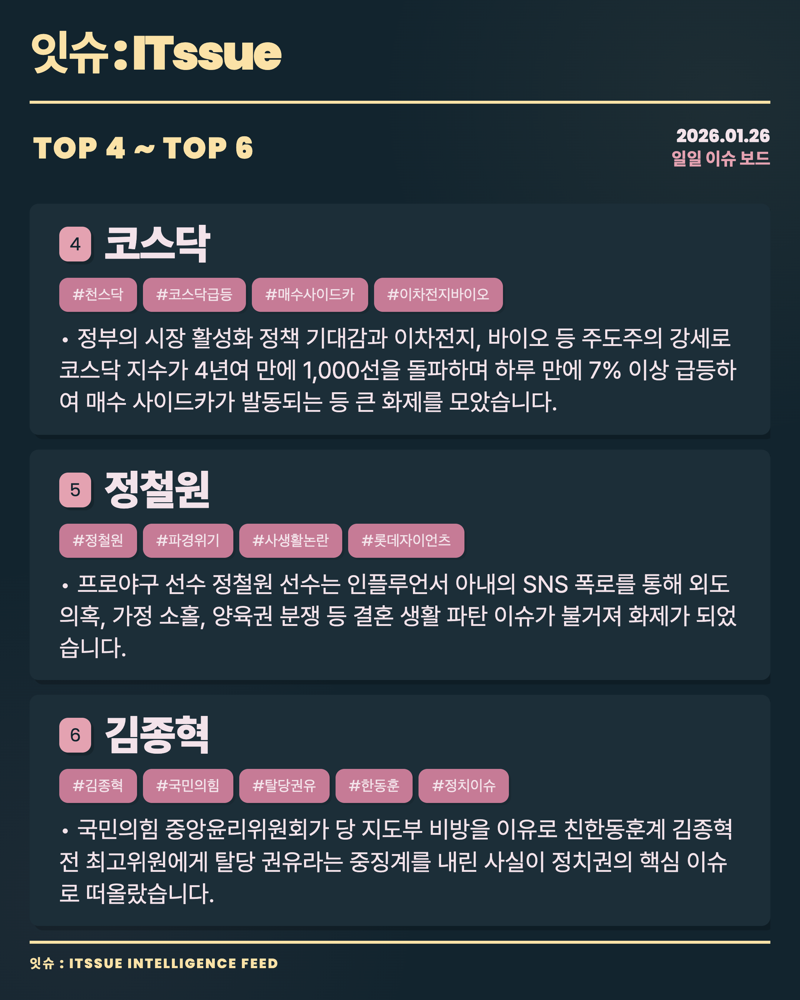
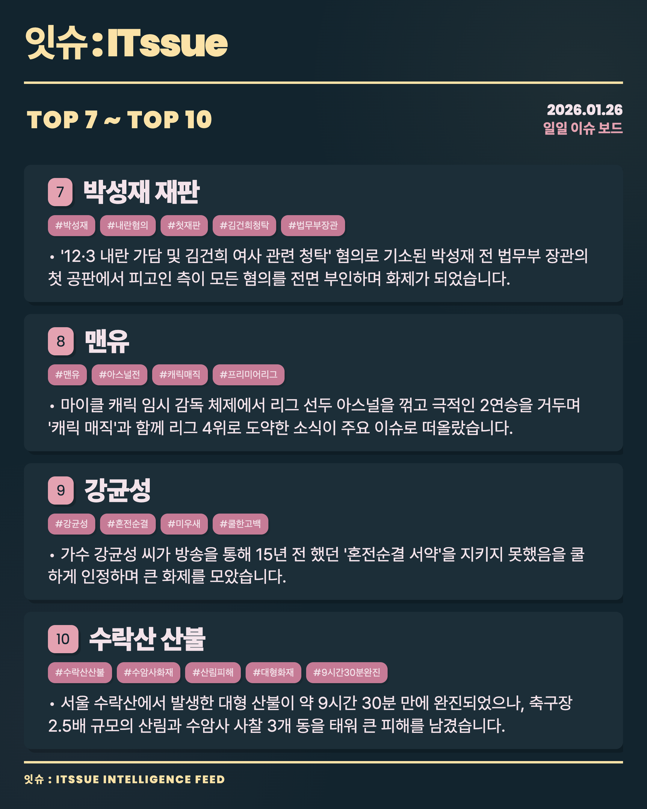
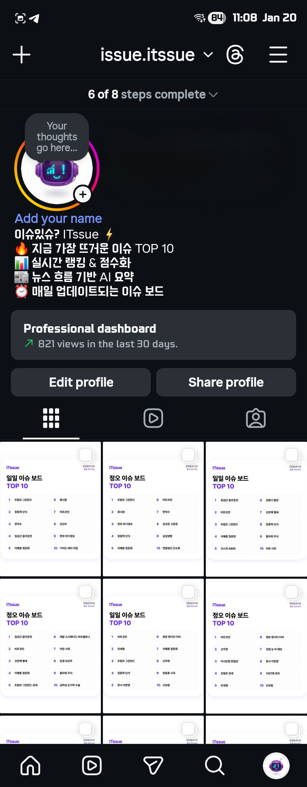
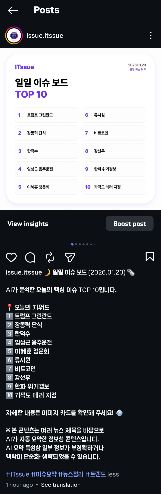

# ITssue: Autonomous Trend Intelligence Engine

    

<div align="center">
  
</div>


## 1. 프로젝트 개요

**ITssue**는 실시간 트렌드 데이터를 스스로 수집하고, 최신 인공지능(Search Grounding) 기술을 통해 심층 분석하여 자동화된 인사이트 리포트와 시각적 카드뉴스 콘텐츠를 생성/발행하는 **자율형 데이터 파이프라인 엔진**입니다. 

단순히 인기 검색어를 나열하는 수준을 넘어, 사건의 본질적인 원인을 분석하고 가독성 높은 시각 자산으로 변환하여 인스타그램에 게시하는 전 과정을 사람의 개입 없이 완결합니다.

---

### 📱 Official Channel
현재 서비스가 실제로 운영되고 있는 채널입니다. QR 코드를 스캔하거나 링크를 통해 실시간 분석 결과물을 확인하실 수 있습니다.

| **Instagram Feed** | **QR Code** |
| :--- | :--- |
| [itssue - 트렌드 지능형 분석 엔진](https://www.instagram.com/issue.itssue/) |  |

---

## 2. 주요 기능

- **Intelligent Search Grounding:** 단순 요약을 넘어 실시간 웹 검색 결과를 기반으로 키워드의 배경과 화제성을 심층 분석하여 신뢰도 높은 인사이트를 추출합니다.
- **Self-Healing AI Pipeline:** API 할당량 초과(429)나 네트워크 장애 발생 시, 등록된 여러 개의 API 키를 순환(`Rotation`)하고 지수 백오프(`Exponential Backoff`) 전략을 통해 무중단 분석을 보장합니다.
- **Advanced Issue Merging:** 동일한 사건에 대해 파편화되어 유입되는 검색어들을 Jaccard 유사도와 형태소 분석을 통해 하나의 유의미한 이슈 그룹으로 병합하고 영향력을 통합 집계합니다.
- **Dynamic Visual Rendering:** Puppeteer를 활용하여 인스타그램 피드 점유율이 가장 높은 **4:5 비율(1080x1350)**의 카드뉴스를 자동 생성합니다. 텍스트 길이에 따라 폰트 크기를 실시간 조절하는 자바스크립트 엔진이 포함되어 있습니다.
- **Theme Synchronization Engine:** 발행 시각(정오/야간)에 따라 최적의 테마(**Arcade/Bubblegum**)를 자동으로 배정하며, 두 테마 간 레이아웃 정합성을 1:1로 유지하여 브랜드 일관성을 확보합니다.
- **Full-Auto Publishing:** 분석 데이터와 렌더링된 이미지를 Supabase Storage와 연동하고, Instagram Graph API를 통해 캡션 포함 캐러셀(Carousel) 형태로 자동 게시합니다.
- **Unified Admin Dashboard:** 발행된 이슈를 실시간 모니터링하고, 수동으로 데이터를 수정하거나 재발행할 수 있는 전용 관리자 도구(Next.js)를 제공합니다.
- **High-Quality Code Architecture:** 중앙 집중형 타입 시스템, 표준화된 주석 체계, 프로젝트 전역 로깅 시스템(Logger)을 통해 프로젝트의 완성도와 유지보수성을 극대화했습니다.

## 3. 기술 아키텍처 및 구현

데이터 수집부터 최종 발행까지 계층화된 Pipe-and-Filter 아키텍처로 설계되었습니다.



## 4. 문제 해결 및 기술 의사결정 과정

- **문제 1: 파편화된 검색어 데이터의 통계 왜곡**
  - **현상:** 동일한 사건(예: 특정 인물 이슈)임에도 "이름", "이름 사건", "이름 결과" 등 서로 다른 키워드로 분산되어 순위권에서 밀려나는 현상 발생.
  - **분석:** 단순 문자열 일치 방식으로는 실시간 검색어의 변동성을 따라갈 수 없음을 확인.
  - **해결:** **Jaccard Similarity**(자카드 유사도)와 **Overlap Ratio** 알고리즘을 결합한 병합 게이트를 구축했습니다. 텍스트의 공통 분모를 분석하고 인물/단체 등 핵심 엔티티를 비교하여 관련 이슈를 하나의 그룹으로 병합하고 점수를 합산함으로써 통계적 정합성을 확보했습니다.

- **문제 2: 클라우드 AI API의 할당량 제한(Rate Limit)**
  - **현상:** AI 분석 API 무료 티어 사용 시 정해진 시간 내 요청 횟수를 초과(429 Error)하여 파이프라인이 중단되는 문제 발생.
  - **분석:** 단일 API 키로는 10분 주기 또는 다량의 키워드 분석 시 안정성을 보장하기 어려움.
  - **해결:** **Multi-Key Rotation 시스템**을 도입했습니다. 여러 개의 API 키를 순환하며 상태를 추적하고, 장애 발생 시 즉시 다음 키를 사용하도록 설계했습니다. 또한 `Wait-and-Retry` 전략과 점진적 대기 시간을 적용하여 24시간 자율 운영 환경에서의 회복 탄력성을 높였습니다.

- **문제 3: 서버 환경과 로컬 데이터 간의 시각 처리(Timezone) 불일치**
  - **현상:** 클라우드 서버(UTC)와 데이터 소스(KST) 간의 9시간 오차로 인해 특정 시간대(정오/일일)의 데이터가 윈도우 분석에서 누락되는 현상.
  - **분석:** `toISOString()` 사용 시 타임존 오프셋이 소실되어 Supabase 쿼리 시 잘못된 데이터 범위를 참조함.
  - **해결:** 모든 유입 데이터에 명시적인 타임존 오프셋(`+09:00`)을 부여하는 `normalizeKstTimestamp` 헬퍼 함수를 구현했습니다. 이를 통해 DB에는 절대 시각(UTC)으로 저장하되, 비즈니스 로직에서는 KST 기반의 정확한 분석 주기를 계산할 수 있도록 동기화했습니다.

## 5. 코드 품질 및 유지보수성

프로젝트 전반에 걸쳐 체계적인 코드 가이드라인을 적용하여 장기적인 유지보수성을 고려했습니다.

### 📐 중앙 집중형 타입 시스템
- **단일 진실 공급원(Single Source of Truth)**: `src/types/index.ts`를 중심으로 모든 데이터 인터페이스를 통합 관리합니다.
- **중복 제거**: 여러 모듈에 흩어져 있던 로컬 인터페이스를 제거하고 `FinalIssueBoard`, `IssueEntity` 등 핵심 타입으로 통일했습니다.
- **타입 안전성**: TypeScript 컴파일러(`tsc`)를 통한 정적 타입 검증으로 런타임 에러를 사전에 방지합니다.

### 📝 표준화된 주석 및 로깅 시스템
- **구조화된 문서화**: `[Step]`, `[Logic]`, `[Safety]`, `[Optimization]` 태그를 활용하여 코드의 의도와 설계 철학을 명확히 전달합니다.
- **전역 로깅 표준화**: `Logger` 유틸리티를 통해 `[INFO]`, `[PASS]`, `[FAIL]`, `[WARN]` 등 일관된 접두어와 상태별 컬러 로깅을 적용하여 모니터링 가독성을 극대화했습니다.
- **알고리즘 상세 설명**: Union-Find 경로 압축, Jaccard 유사도 계산, Multi-Key Rotation 등 복잡한 로직의 동작 원리를 주석으로 상세히 기록했습니다.

### 🔒 보안 (Security)
- **보안 강화**: Admin API Key를 통한 웹훅 인증, 서버사이드 프록시(Proxy)를 통한 API 키 은닉 등 시스템 보안 장치를 마련했습니다.
- **라이선스 준수**: 오픈소스 라이브러리의 라이선스를 준수하며 프로젝트를 구성했습니다.

---

## 🚀 6. 핵심 운영 Guide (Core Operations)

ITssue 엔진의 주요 실행 및 디버깅 명령어입니다.

### ☀️ 이슈 보드 수동 생성
```bash
# 정오 보드 생성 (Arcade 테마)
npm run board:noon -- --publish

# 야간 보드 생성 (Bubblegum 테마)
npm run board:night -- --publish

# 커스텀 날짜 범위 분석 (YYYY-MM-DD)
npm run board:custom -- 2026-01-20 2026-01-21 --publish
```

### 🐛 디버깅 및 테스트 도구
```bash
# 랭킹 엔진 점수 확인
npm run debug rank 2026-01-20 NOON

# 이슈 병합(Clustering) 결과 검증
npm run debug merge 2026-01-20 NOON

# Cloud AI 요약 분석 테스트
npm run debug summary "분석키워드"
```

---

## 7. 배포 및 운영

- **Infrastructure:** **Supabase**를 백엔드 서버리스 플랫폼으로 채택하여 DB 관리 및 이미지 스토리지로 활용합니다.
- **Batch Processing:** 10분 단위의 데이터 수집과 하루 2회(정오, 밤)의 메인 분석 파이프라인을 자동화했습니다.
- **GCP Server Setup**: 제공된 스크립트를 통해 원터치로 환경을 구축할 수 있습니다.
  - `chmod +x backend/scripts/setup_gcp_server.sh`
  - `./backend/scripts/setup_gcp_server.sh`
- **Automation Daemon (PM2)**:
  - `pm2 start npm --name "itssue-daemon" -- run daemon`
  - `pm2 save && pm2 startup`

## 8. 향후 개선 방향

- **AI Audit System:** AI가 생성한 요약문을 스스로 검토하여 사실 관계가 틀리거나 비문인 경우 재생성하는 자가 교정 로직 도입 예정.
- **Multi-Platform:** 인스타그램 외에 스레드(Threads), 트위터(X) 등 여러 소셜 채널로 발행 플랫폼 확장.

## 9. 실행 결과 (Actual Outputs)

프로젝트를 통해 실제로 생성되어 인스타그램에 업로드되는 고해상도 전체 피드(Full Feed) 예시입니다.

<div align="center">
  <h3>[분석 리포트 & 주요 이슈 카드]</h3>
  <table style="width: 100%; border-collapse: collapse;">
    <tr>
      <td width="33%"></td>
      <td width="33%"></td>
      <td width="33%"></td>
    </tr>
    <tr align="center">
      <td><b>P1. 종합 랭킹</b></td>
      <td><b>P2. 심층 분석 01</b></td>
      <td><b>P3. 심층 분석 02</b></td>
    </tr>
    <tr>
      <td width="33%"></td>
      <td width="33%"></td>
      <td width="33%"></td>
    </tr>
    <tr align="center">
      <td><b>P4. 심층 분석 03</b></td>
      <td><b>P5. 그룹 요약 A</b></td>
      <td><b>P6. 그룹 요약 B</b></td>
    </tr>
  </table>

  <br>

  <h3>[인스타그램 실제 발행 사례]</h3>
  <table style="width: 100%; border-collapse: collapse;">
    <tr>
      <td width="50%"></td>
      <td width="50%"></td>
    </tr>
    <tr align="center">
      <td><b>Instagram Feed 예시 1</b></td>
      <td><b>Instagram Feed 예시 2</b></td>
    </tr>
  </table>
</div>

---
**ITssue**는 데이터에 대한 깊은 이해와 문제 해결을 위한 공학적 접근이 담긴 프로젝트입니다.
